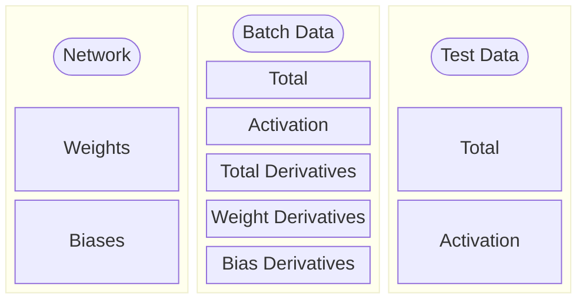

# MachineLearningC++
## Solution for me to experiment and test various kinds of neural networks and cool fractals

This project contains various different kinds of neural networks and datasets. Code is written more or less from scratch, from the matrix class to dot prod.
Some of the datasets / fractals included are

* MNIST
* Mandlebrot

With future plans for datasets being
* fMNIST
* Barnsley ferns
* N-body simulation data

Datasets are currently stored in just a .cpp file that can be included into new projects pretty easily.
There are many different iterations of neural networks in the solution, these are built as .lib files and stored in Dependencies\lib the following are the names of the aforementioned neural networks.
* NeuralNetwork
* NeuralNetwork_2
* SingleBlockNeuralNetwork
* SingleBlockCudaNetwork

## NeuralNetwork
This was my first attempt at a neural network class in c++, I've made function-based networks in the past, although these relied heavily on global variables and c++ malpractice. This was my first attempt to move away from that and standardize my use of neural networks and machine learning techniques.

## NeuralNetwork_2
CURRENTLY NOT COMPLETE (or even started truthfully)  
This project aims to take the organization I learned from NeuralNetwork and lobotomize it with template metaprogramming and other eldritch techniques

## SingleBlockNeuralNetwork
This project completely does away with the Matrix class I poured my soul into, instead it opts for the ever loved pointers. Specifically, I malloc 3 different pointers
* m_network
* m_batch_data
* m_test_data

which are structured as follows  

## SingleBlockCudaNetwork
CURRENTLY NOT WORKING  
This project is my first attempt at running a neural network completely on cuda, I hope to use a similair design to SingleBlockNeuralNetwork
