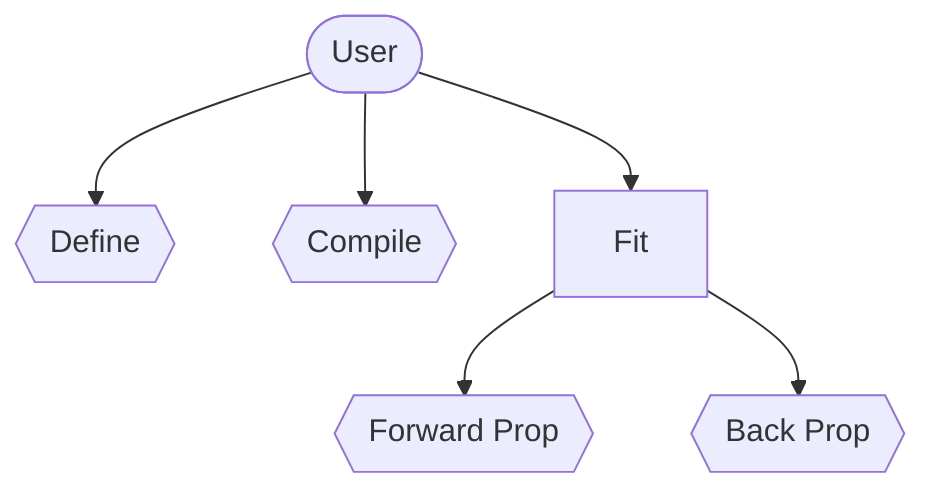
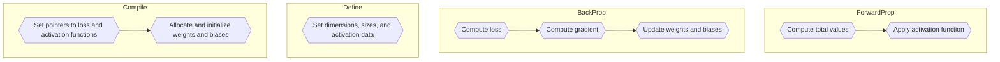
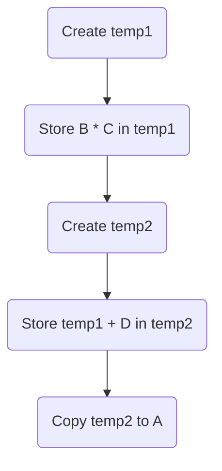

# MachineLearningC++
## Solution for me to experiment and test various kinds of neural networks and simulate cool fractals
This project contains various different kinds of neural networks and datasets. Code is written more or less from scratch, from the matrix class to dot prod.

## Datasets
Some of the datasets / fractals included are
* **MNIST**
* **Mandlebrot**
* **FMNIST**

With future plans for datasets being
* **Barnsley ferns**
* **N-body simulation data**

Dataset loaders are just stored in a static class in a .cpp file, easy enough to include. The actual datasets are located in **_Dependencies\datasets_**
 

## Neural Networks
There are many different iterations of neural networks in the solution, these are built as .lib files and stored in **_Dependencies\lib_** the following are the names of the aforementioned neural network projects.
* **NeuralNetwork**
* **NeuralNetwork_2**
* **SingleBlockNeuralNetwork**
* **SingleBlockCudaNetwork**

### Neural Network
This was my first attempt at a neural network class in c++, I've made function-based networks in the past, although these relied heavily on global variables and c++ malpractice. This was my first attempt to move away from that and standardize my use of neural networks and machine learning techniques.
  
This network makes use of the **Matrix** class to do most of the arithmetic, and doesn't implement too many optimizations in of itself, some of the ones it does include being **Bias.h** to handle calculations regarding biases, keeping them all in one location in memory. Also uses a custom update loop for weights and biases that takes better advantage of simd intrinsics.
  
Major performance problems with this network are mostly tied to the matrix class itself, which I'll go more in depth in a dedicated section, however, just know, theres's a lot of unnecessary memory allocations and copies. *Who doesn't love temp objects?* 
  
The higher level structure I created for this class set the basis for all other classes, although exact implementations vary, and different networks have various levels of abstraction, the general control flow looks the same for all of them.

 

### Neural Network 2
**CURRENTLY NOT COMPLETE** (or even started truthfully)  
This project aims to take the organization I learned from NeuralNetwork and lobotomize it with template metaprogramming and other eldritch techniques

### Single-Block Neural Network
This project completely does away with the **Matrix** class I poured my soul into, instead it opts for the ever loved pointers. Specifically, I allocate memory for three different pointers
* *m_network*
* *m_batch_data*
* *m_test_data*

which are structured as follows 
 

I also make heavy use of pointer arithmetic to make my life easier, such as *m_biases* which points to **_biases_**, *m_test_activation* which points to... you guessed it, **_test_activation_**, and so on so forth.
  
The main benefit of this network over the **NeuralNetwork** class is that it allocates all the memory it needs up front. By doing this, we avoid the creation of temp objects and massive copies, instead just storing the data directly where we want it to be in the first place. Another benefit of doing this is we can chain operations together much better, for exmaple, if we wanted to do **_A = B * C + D_** where A, B, C, D are all matrices of the same size, in the **Matrix** class that would look something like this

Quite a lot of work, and most of it is pointless too. Instead, if we apply a minimal amount of thinking, we can do this.

Woah! That's insane! As it turns out, if we know we want the data to be in A from the beginning, we can just directly store data into A, on top of that, we can directly chain the simd operations we want to do together, doing them all in place, meaning we don't need any temp objects, and in this specific situation we can directly compute **_B * C + D_** with a fmadd simd instrinsic leaving us with just a few instructions, much better than all the temp objects and copies we were previously doing.
  
Transposes are also a big part of forward_prop and back_prop, however, these transposes are only really used in dot products with other matrices, as such, if we just *read* the data in a transposed manner, we can get the right result, without having to bother with actually transposing the matrix. Changing around a couple for loops also ensures we maintain decent cache access.
  
Of course, this class also make use of optimizations already present in the **Matrix** class, like omp for parallelization, and simd intrinsics.
  
Overall I observed a 3-4x performance boost using this class over the **NeuralNetwork** class
 
Below are a couple results on various network sizes for **MNIST**
  

### Single-Block Cuda Network
**CURRENTLY NOT WORKING**  
This project is my first attempt at running a neural network completely on CUDA, I hope to use a similair design to **SingleBlockNeuralNetwork**

## Actual Projects
Ok so now we've convered the stuff that does all the math, I'd like to mention the stuff that actually does stuff, specifically
* **MNISTNetwork**
* **MNIST_SBNeuralNetwork**
* **MNIST_CNN**
* **MandlebrotNetwork**
* **Mandlebrot_SBNN**
 

### MNISTNetwork
This network trains on the **MNIST** dataset using the **NeuralNetwork** class, truly machine learning 101, nothing all that special to say about it.
 

### MNIST_SBNeuralNetwork
This one, while quite a mouthful, trains on the **MNIST** dataset, using the **SingleBlockNeuralNetwork** class, this project currently holds my record on mnist of **98.47%** which was achieved using 3 hidden layers of size 1024, and leaky_relu activation in the hidden layers, and sigmoid for the final.
 

### MNIST_CNN
This network trains on, yet again, the **MNIST** dataset using the **SingleBlockCudaNetwork** class, although at time of writing, is still not functional.
 

### MandlebrotNetwork
This network is what really got me into fractals and neural networks alike, taking inspiration from 
 
https://www.youtube.com/watch?v=TkwXa7Cvfr8 (great video by the way you should totally watch it)
  
I took the idea of approximating the mandlebrot with neural networks and ran with it, this specific version uses the **NeuralNetwork** class, some of the better images it produced being
  

.bmp)
*This bad boy was trained on and off over the course of a couple weeks*   

*This guy probably took closer to a month, although it used a smaller network than in the previous image*  

*Oh and just for reference heres what a "perfect" mandlebrot would look like*  

### Mandlebrot_SBNN
Thinking about how much time I spent using the old network pains me, with the performance improvements I managed with the **SingleBlockNeuralNetwork** perhaps I could've actually touched grass. At any rate this uses the aforementioned network and approximates the mandlebrot. 
  
As I finished this one much more recently, and I kind of exhausted myself on the mandlebrot already, I haven't trained with this one anywhere near as much, as such predictions are much lower quality.

## Honorable Mentions

### Matrix
Truly this is where it began
